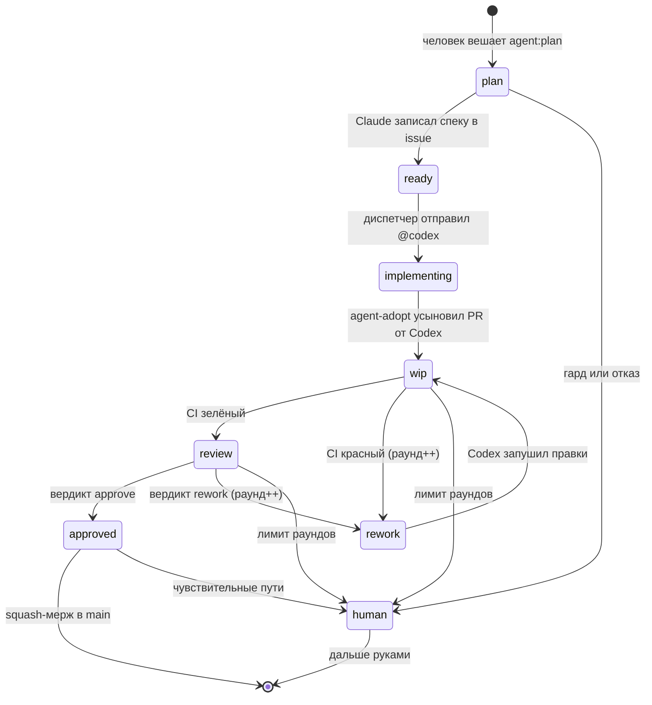

# Событийный цикл Claude ↔ Codex

Claude планирует и ревьюит, Codex реализует, мержит детерминированный джоб.
Всё держится на событиях GitHub: никто нигде не ждёт в цикле опроса.

Пошаговая настройка и запуск — `docs/runbook.md`.

Ответ на вопрос «webhooks или Actions» — Actions. Actions **и есть** потребитель
вебхуков, которого не надо хостить. Свой webhook-сервер окупается только при
оркестрации нескольких репозиториев, своей очереди или своём UI.

---

## 1. Три факта, на которых держится конструкция

1. **События, созданные `GITHUB_TOKEN`, не запускают новые workflow** — защита GitHub
   от рекурсии. Исключения: `workflow_dispatch` и `repository_dispatch`. Поэтому все
   «будящие» действия делаются токеном GitHub App.
2. **`claude-code-action` не создаёт PR и не умеет мержить.** Ограничение зашито в его
   системный промпт и не снимается через `--allowedTools`. Поэтому PR открывает Codex,
   а мержит `agent-merge.yml`.
3. **Интеграция Codex Cloud привязывает задачу к аккаунту ChatGPT автора упоминания
   и отклоняет ботов.** Поэтому комментарий `@codex` постится личным PAT владельца —
   это единственное место во всём цикле, где нужен PAT.

---

## 2. Схема состояний



`human` = `agent:needs-human` — терминальное состояние. Его **никто не потребляет**,
в этом весь смысл: машина действительно останавливается.

---

## 3. Лейблы

| Лейбл | Где | Ставит | Будит |
| --- | --- | --- | --- |
| `agent:plan` | issue | **человек** (единственный ручной вход) | `agent-plan.yml` |
| `agent:ready` | issue | `agent-plan.yml` | `agent-dispatch.yml` |
| `agent:implementing` | issue | `agent-dispatch.yml` | — (маркер, ждём PR) |
| `agent:wip` | PR | `agent-adopt.yml`, `agent-dispatch.yml` | — (ждём CI) |
| `agent:review` | PR | `agent-gate.yml` | `agent-review.yml` |
| `agent:rework` | PR | `agent-gate.yml`, `agent-review.yml` | `agent-dispatch.yml` |
| `agent:approved` | PR | `agent-review.yml` | `agent-merge.yml` |
| `agent:needs-human` | issue + PR | любой сработавший гард | **ничего** |
| `agent:paused` | issue + PR | человек | — (исключение во всех `if:`) |

Счётчик раундов — **не лейбл**, а HTML-комментарий в теле PR:
`<!-- agent-round: N -->`. Причина: он уже есть в payload почти каждого события цикла,
а `pull_request: edited` никто не слушает — правка тела ничего не будит и не зацикливается.
Там же живут `<!-- agent-issue: N -->` и `<!-- agent-approved-sha: … -->`.

---

## 4. Workflow

| Файл | Триггер | Что делает |
| --- | --- | --- |
| `ci.yml` | `pull_request`, `push: main` | `fast` (компиляция + тесты без Docker) и `full` (`./gradlew check`). `full` зависит от `fast`: на несобирающемся коде не платим за Testcontainers |
| `agent-plan.yml` | `issues: labeled` = `agent:plan` | Claude раскладывает задачу, спека дописывается в тело issue |
| `agent-dispatch.yml` | `issues: labeled` = `agent:ready`, `pull_request: labeled` = `agent:rework` | **Единственное место с PAT.** Постит `@codex` с заданием |
| `agent-adopt.yml` | `pull_request: opened` | Находит задачу по `Closes #N`, вписывает маркеры состояния |
| `agent-gate.yml` | `workflow_run` по CI | Маршрутизирует результат: зелёный → ревью, красный → доработка |
| `agent-review.yml` | `pull_request: labeled` = `agent:review` | Claude пишет `verdict.json`, лейбл ставит workflow |
| `agent-merge.yml` | `pull_request: labeled` = `agent:approved`, `workflow_run` | Восемь гардов, затем squash-мерж |
| `agent-janitor.yml` | раз в 6 часов | Паркует зависшее в `agent:needs-human` |

Почему спека лежит в теле issue, а не в файле на ветке: в Фазе 1 ветку создаёт
Codex Cloud, её имя нам неподконтрольно. Координация «закоммить в нашу ветку» была бы
ещё одним недоказанным звеном. Ревьюер читает спеку через `gh issue view` по `Closes #N`.

---

## 5. Токены

| Действие | Токен | Почему |
| --- | --- | --- |
| Любой `--add-label`, который должен что-то разбудить | **App** | события от `GITHUB_TOKEN` не запускают workflow |
| `gh pr merge` | **App** | то же + идентичность в bypass-списке защиты ветки |
| Комментарий `@codex` | **PAT владельца** | Codex Cloud отклоняет ботов |
| Статусные комментарии | App или `GITHUB_TOKEN` | ничего не будят |

**Что молча умрёт, если взять `GITHUB_TOKEN`:** цепочка рвётся на каждой стрелке.
Самое разрушительное — `pull_request: opened`: не запустится CI, а значит не будет
`workflow_run`, а значит не отработают гейт, ревью, доработка и мерж. Четыре workflow
за раз, без единой ошибки в логах.

**Права GitHub App:** Metadata `R`, Contents `RW`, Pull requests `RW`, Issues `RW`,
Actions `R`, Checks `R`. Право **Workflows не выдавать** — это бесплатный серверный
гард: без него GitHub сам отклонит любой push, трогающий `.github/workflows/**`.
Агенты физически не смогут переписать собственный CI. Administration — никогда.

---

## 6. Настройка (делается руками, один раз)

1. Перевести репозиторий в **private**. Предусловие для Фазы 2 и защита от fork-PR.
   Цена: минуты Actions на приватном репо платные (Free — 2000 мин/мес).
2. Создать GitHub App на личном аккаунте, установить только на этот репозиторий,
   права из раздела 5. Записать:
   - переменная `AGENT_APP_ID`
   - секрет `AGENT_APP_PRIVATE_KEY` (содержимое PEM)
3. Узнать логин и id бота:
   `gh api /users/<app-slug>%5Bbot%5D --jq '.login, .id'`
4. Создать fine-grained PAT (только этот репозиторий; Contents `RW`, Issues `RW`,
   Pull requests `RW`, Metadata `R`) → секрет `AGENT_CODEX_PAT`.
5. Проверить, что секрет `CLAUDE_CODE_OAUTH_TOKEN` жив.
6. Завести переменные репозитория:

   | Переменная | Значение | Смысл |
   | --- | --- | --- |
   | `AGENT_LOOP_ENABLED` | `false` пока не проверено | **kill switch**: выключает весь цикл, не удаляя workflow |
   | `AGENT_APP_ID` | id приложения | |
   | `AGENT_BOT_LOGIN` | `<app-slug>[bot]` | проверка, кто поставил `agent:approved` |
   | `AGENT_CODEX_LOGIN` | логин бота Codex | чтобы не дублировать ревью |
   | `AGENT_ALLOWED_BOTS` | `<app-slug>[bot],<codex-login>` | иначе `claude-code-action` проигнорирует запуск как ботовый |
   | `AGENT_MAX_ROUNDS` | `3` | лимит раундов доработки |
   | `AGENT_MAX_FILES` | `15` | бюджет диффа |
   | `AGENT_MAX_LINES` | `400` | бюджет диффа |
   | `AGENT_STALE_HOURS` | `6` | порог сторожа |
   | `AGENT_AUTOMERGE_ENABLED` | `false` до этапа 7 | отдельный выключатель мержа: цикл доводит до `agent:approved` и ждёт тебя |
   | `AGENT_RUNS_ON` | не задавать | переезд на свой раннер (`self-hosted`), см. `ops/README.md` |
   | `AGENT_SENSITIVE_PATHS` | regex, см. `agent-merge.yml` | пути, которые мержит только человек |

7. Завести лейблы: `agent:plan`, `agent:ready`, `agent:implementing`, `agent:wip`,
   `agent:review`, `agent:rework`, `agent:approved`, `agent:needs-human`, `agent:paused`.
8. Подключить репозиторий к Codex Cloud.
9. **Смержить `agent-gate.yml` и `agent-merge.yml` в `main` до первого прогона.**
   `workflow_run` запускается только из копии файла на ветке по умолчанию.

---

## 7. Стоп-гейт: три недоказанных звена

Ничего из этого не подтверждено документацией. Проверить **до** включения цикла.

- **S1.** Написать в issue руками `@codex …` и посмотреть: стартует ли облачная задача
  и **открывается ли PR без ручного клика**.
- **S2.** То же, но комментарий отправлен токеном:
  ```
  gh api repos/devDaniilNovikov/Marketplace/issues/N/comments \
    -f body='@codex ...' -H "Authorization: Bearer $AGENT_CODEX_PAT"
  ```
  **Если Codex не реагирует — Фаза 1 невозможна.** Нужен либо `OPENAI_API_KEY`
  и `openai/codex-action`, либо сразу Фаза 2.
- **S3.** Убедиться, что PR, открытый Codex, запускает `ci.yml`.

Результаты записать в `.agents/MEMORY.md` в таблицу решений.

---

## 8. Гарды мержа

Мерж выполняется, только если верно **всё** сразу:

1. `AGENT_LOOP_ENABLED == 'true'`;
2. есть `agent:approved`, нет `agent:needs-human` и `agent:paused`;
3. `<!-- agent-approved-sha -->` равен текущему head — защита от гонки
   «одобрено → запушили → смержено»;
4. база `main`, PR не черновик, конфликтов нет;
5. `agent:approved` поставил бот цикла, а не человек руками;
6. джоб `full` зелёный **именно на этом SHA** (не «последний прогон прошёл»);
7. дифф в бюджете `AGENT_MAX_FILES` / `AGENT_MAX_LINES`;
8. нет запрещённых путей, миграции только добавлены.

Чувствительные пути (`core/security/`, `db/changelog/`, `build.gradle.kts`,
`settings.gradle.kts`) не отклоняются, а передаются человеку: PR остаётся зелёным
и одобренным, но кнопку жмёшь ты.

**Защита ветки.** Не включать «Require approving reviews»: App не может одобрить
собственный PR, и мерж упрётся в `405`. Включить только required status check `full`,
squash-only и линейную историю. Не включать «Require branches to be up to date» —
обновление ветки меняет SHA, сбрасывает маркер одобрения и запускает бесконечный
цикл переревью. Если защита ветки на текущем плане GitHub недоступна, гарды
merge-джоба остаются **единственным** гейтом — они для этого и написаны полными.

---

## 9. ArchUnit: гейт сейчас не работает

`archunit_store` не закоммичен, а `allowStoreCreation=true`. Каждый свежий чекаут
создаёт стор заново и замораживает в том числе **новые** нарушения. Правило не падает
никогда. Для автопилота это критично: единственный автоматический контроль изоляции молчит.

Починка в два шага:

1. `./gradlew test --tests '*ArchitectureTest'` (Docker не нужен), закоммитить
   появившийся `src/test/resources/archunit_store`.
   Путь задаётся строкой `freeze.store.default.path` в `archunit.properties`: без неё
   ArchUnit кладёт стор относительно рабочего каталога JVM тестов, то есть в корень
   проекта. В прогоне №1 из-за этого артефакт оказался пуст.
   В CI стор выгружается артефактом `archunit-store-<run_id>` джобом `full`.
2. Поставить `freeze.store.default.allowStoreCreation=false` в `archunit.properties`.

До шага 2 не считать зелёный CI доказательством изоляции доменов.

Отдельно: `MarketplaceApplicationTests` помечен `@Disabled`, пока не сделаны B1–B3.
Значит «CI зелёный» **не означает**, что контекст Spring поднимается. Держи
`AGENT_MAX_FILES` маленьким, пока тест не включён обратно.

---

## 10. Стоимость

Приватный репозиторий → минуты Actions платные (Free: 2000 мин/мес).

| Джоб | Первоначальная оценка | Факт на зелёном прогоне |
| --- | --- | --- |
| `fast` | 3–4 мин | **1 мин 42 с** |
| `full` (холодный кеш, Testcontainers) | 8–10 мин | **1 мин 50 с** |
| Задание агента | 3–5 мин | не измерялось |

Оценка по `full` была завышена в пять раз: холодный прогон с подъёмом Postgres
и Redis укладывается менее чем в две минуты.

Пересчёт: раунд «реализация → ревью» ≈ 5–7 мин вместо 15, типовая задача
в 2–3 раунда ≈ 12–18 мин вместо 35–45. **На бесплатном лимите это ≈ 110–160 задач
в месяц, а не 45–55** — цена перевода репозитория в private оказалась заметно ниже
заложенной.

`needs: fast` у `full` всё равно окупается: раунд с несобирающимся кодом стоит
полторы минуты вместо трёх с половиной.

---

## 11. Порядок включения

Не включать всё сразу — иначе отлаживать придётся пять вещей одновременно.

1. Только `ci.yml`. Запустить через `workflow_dispatch`. Выяснить, что вообще падает:
   `./gradlew check` в этом репозитории **не проходил ни разу** — пункт «Прогон тестов»
   в `TASKS.md` до сих пор заблокирован отсутствием Docker. Это не баг цикла, это
   первое честное знакомство с состоянием тестов.
2. Починить ArchUnit (раздел 9).
3. Создать App, проверить цепочку: одноразовый workflow, который ставит лейбл токеном
   App, и второй, который на `issues: labeled` реагирует. Этот один опыт снимает
   весь риск раздела 5.
4. Смоук-тесты S1–S3 (раздел 7).
5. Включить `agent-plan.yml`, прогнать задачу дорожки **[I]** вручную.
6. Добавить `agent-dispatch.yml`, `agent-adopt.yml`, `agent-gate.yml`.
7. Добавить `agent-review.yml`. **Первые три задачи довести до `agent:approved`
   и смержить руками** — нужна выборка вердиктов, чтобы понять долю ложных одобрений.
8. Только потом `agent-merge.yml` и `AGENT_LOOP_ENABLED=true`.

---

## 12. Типовые отказы

| Симптом | Причина | Где смотреть |
| --- | --- | --- |
| Лейбл встал, ничего не запустилось | запись сделана `GITHUB_TOKEN` | `gh api repos/O/R/issues/N/timeline --jq '.[]\|select(.event=="labeled")\|.actor.login'` — если `github-actions[bot]`, это он |
| PR открылся, CI не запустился | то же на `gh pr create` — убивает 4 workflow разом | вкладка Actions пуста для нового PR |
| Джоб Claude отработал вхолостую | действие игнорирует ботовые триггеры | заполнить `AGENT_ALLOWED_BOTS`; попробовать логин и с суффиксом `[bot]`, и без |
| `agent-gate` не срабатывает | `workflow_run` берёт файл только с ветки по умолчанию; `workflows:` должно совпадать с `name:` в `ci.yml` дословно | смержить в `main` до проверки |
| 401 при пуше после долгого агента | токен установки живёт час | перевыпустить токен шагом перед git-операцией (во всех workflow это сделано) |
| Мерж `405` | защита ветки требует ревью, App не может одобрить свой PR | раздел 8 |
| Задача висит в `agent:wip` вечно | раннер умер; `agent:wip` никто не слушает, кроме гейта | сторож; проверить `gh run list --json conclusion` на `cancelled` |
| Два ревьюера спорят в одном PR | `claude-code-review.yml` тоже сработал | гард по автору PR уже стоит; проверить `AGENT_CODEX_LOGIN` |
| Бесконечный цикл `@claude` | комментарий агента содержал `@claude` | тела комментариев прогоняются через `sed` — проверить, что шаг не потерялся |

Общий порядок отладки любого «ничего не произошло»: было ли событие → кто его автор →
стартовал ли прогон → не выключил ли его `if:` (в логе джоба видно вычисленное выражение).

---

## 13. Фаза 2: переезд на self-hosted runner

Когда появится VPS. Стейт-машина не меняется, меняется исполнитель.

- Раннер **прямо на хосте** под отдельным непривилегированным пользователем, не в
  контейнере: Testcontainers внутри контейнера потребовали бы проброса
  `/var/run/docker.sock`, а это фактически root на хосте — изоляция, ради которой
  контейнер и заводили, обнуляется. **Только на приватном репозитории**: на публичном
  PR из форка выполнит произвольный код на твоей машине.
  Развёртывание: `ops/vps-bootstrap.sh`, проверка: `ops/vps-verify.sh`, подробности
  и размер машины — `ops/README.md`.
- Переключение одной переменной репозитория `AGENT_RUNS_ON = self-hosted`;
  она подставляется в `runs-on` всех джобов цикла. Откат — удалить переменную.
- `codex login` по подписке ChatGPT → `codex exec` вызывается прямо из workflow.
  Исчезают: хоп через комментарий `@codex`, PAT, `agent-adopt.yml` и зависимость
  от Codex Cloud. `agent-dispatch.yml` сам запускает Codex, коммитит и открывает PR.
- Тёплый Gradle-кеш и локальные образы → `full` падает с ~9 до ~2 минут.
- Минуты Actions не тратятся.
- Проверить, допускает ли ToS подписок headless-использование в CI, прежде чем
  строить на этом постоянный процесс.
